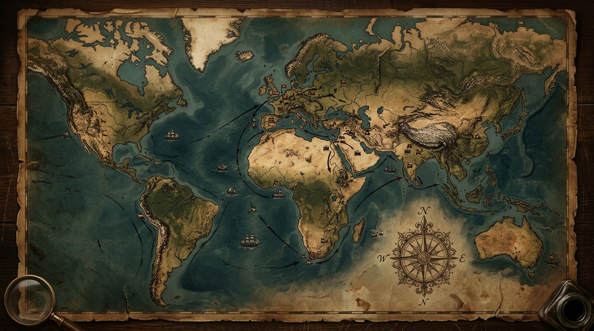

# 👑 امپراتوری (Empire)

یک **بازی استراتژی بزرگ (Grand Strategy)** تحت وب به سبک *Victoria 3* — با رابط فارسی راست‌چین، نقشه‌ی زنده‌ی رندرشده روی بوم نقاشی، اقتصاد کالا-محور، طبقات اجتماعی، سیاست داخلی، دیپلماسی و جنگ.



## خطوط زمانی

| خط زمانی | سال | نقشه | ملت‌ها |
|---|---|---|---|
| 👑 ویکتوریا فانتزی | ۱۸۳۶ | جهان فانتزی (۴ سناریو: توازن / رستاخیز آریان / عصر ماشین / طوفان آهنین) | ۱۰ قدرت خیالی |
| 🎖️ جنگ جهانی اول | ۱۹۱۴ | نقشه‌ی واقعی جهان با کشورهای واقعی | بریتانیا، فرانسه، آلمان، روسیه، اتریش-مجارستان، ایتالیا، عثمانی، آمریکا، ژاپن، چین |
| 💥 جنگ جهانی دوم | ۱۹۳۸ | نقشه‌ی واقعی جهان | آلمان، بریتانیا، فرانسه، ایتالیا، شوروی، آمریکا، ژاپن، چین، لهستان، ترکیه |
| 🌐 دنیای مدرن | ۲۰۲۶ | نقشه‌ی واقعی جهان | آمریکا، چین، روسیه، هند، ایران، آلمان، بریتانیا، فرانسه، ژاپن، برزیل، کره، عربستان، مصر، ترکیه |

اقتصاد در همه‌ی خطوط زمانی نقش کلیدی دارد: بازار جهانی کالا، زنجیره‌های تولید، مالیات و تراز خزانه، و هزینه‌ی ارتش.

## اجرا

کافی است ریشه پروژه را با یک وب‌سرور ایستا سرو کنید:

```bash
python3 -m http.server 8080
# یا
npx serve .
```

سپس `http://localhost:8080` را باز کنید.

## ویژگی‌ها

- 🗺️ **نقشه‌ی بزرگ و زنده**: نقشه‌ی فانتزی procedural (۳۲۰۰×۱۶۰۰) + نقشه‌ی واقعی جهان با ۳۸ کشور و ۳۵۴ شهر واقعی (پایتخت‌ها درست روی کشور خودشان)؛ ۵ مُد نقشه (سیاسی، زمین، جمعیت، تولید، ناآرامی)؛ دود کارخانه‌ها، ابرهای متحرک، پرچم‌های برداری، مینی‌مپ، زوم و پن نرم.
- 🌾 **اقتصاد بازار جهانی**: ۱۰ کالا با قیمت‌گذاری عرضه/تقاضای زنده، زنجیره‌های تولید (مزرعه → الیاف → نساجی → پوشاک…)، کمبودها، صنایع دستی خانگی و نمودار قیمت. خرید ساختمان، هزینه‌ی کامل را از خزانه کم می‌کند (باگ پول رفع شد).
- 👥 **جمعیت (Popها)**: ۷ طبقه‌ی اجتماعی با دستمزد، نیازها، امید به زندگی (SoL)، بی‌کاری، مهاجرت داخلی و رشد جمعیت.
- 🏛️ **سیاست**: ۶ گروه ذی‌نفع با قدرت و خشنودی، ۳ دسته قانون قابل تصویب (مالیات، کار، حکمرانی)، ۵ سطح مالیات، تراز خزانه‌ی هفتگی، شورش‌های داخلی.
- 🎓 **۱۸ فناوری** در ۳ شاخه‌ی صنعت/نظام/جامعه با اثرهای واقعی روی تولید، ارتش و جامعه.
- 🤝 **دیپلماسی**: روابط، پیمان تجاری، اتحاد، پیشنهادهای دوطرفه، اعلام جنگ با هدف استانی.
- ⚔️ **جنگ**: گردان‌ها و ارتش‌های متحرک روی نقشه، نبردهای چندهفته‌ای با تعدیل‌دهنده‌ی زمین/فناوری/سازمان، اشغال، امتیاز جنگ، صلح سفید یا تحمیل خواسته‌ها (الحاق استان + غرامت).
- 🤖 **هوش مصنوعی** ملت‌ها با ۵ شخصیت (جنگ‌جو، صنعتی، بازرگان، صلح‌طلب، متعادل): می‌سازند، پژوهش می‌کنند، قانون می‌گذارند، اتحاد می‌بندند و حمله می‌کنند. هوش، پرخاشگری و سرعت واکنش با درجه‌ی سختی تغییر می‌کند.
- 📜 **۴۹+ رویداد** با **دو نسخه‌ی متن** (نسخه‌ی اصلی رسمی/ادبی + ترجمه‌ی ساده‌ی محاوره‌ای)؛ اکثراً یک‌بارمصرف با نمایش کوتاه‌تر و تصمیم‌های اثرگذار روی اقتصاد، ارتش و جامعه. رویدادهای ویژه‌ی خط زمانی (جنگ بزرگ، زیردریایی، بلیتز، جیره‌بندی، سایبر، تحریم، پناهندگان، جاسوسی).
- 📖 **توتوریال کامل قدم‌به‌قدم** (۱۲ صفحه) از نقشه و دوربین تا اقتصاد، سیاست، جنگ و رویدادها؛ از منو و داخل بازی در دسترس است.
- 🎚️ **۴ درجه‌ی سختی** (آسان/معمولی/سخت/افسانه‌ای): در «افسانه‌ای» تایم فقط پاز/آن‌پاز است و سرعت‌بخشی غیرفعال می‌شود.
- 👑 **هدف**: تا سال پایان خط زمانی (۱۹۰۰ / ۱۹۱۹ / ۱۹۵۰ / ۲۰۴۰) قدرت اول جهان باش (بیشترین اعتبار). ذخیره‌ی خودکار در `localStorage`.

## کنترل‌ها

| کلید | عمل |
|---|---|
| Space | مکث / ادامه |
| 1..4 | سرعت بازی |
| موس | درگ = پن، اسکرول = زوم، کلیک = انتخاب استان |
| انتخاب ارتش + کلیک | فرمان حرکت/حمله |
| Esc | بستن پنل / لغو انتخاب |

## ساختار کد

```
index.html        پوسته‌ی UI
css/style.css     تم مرمر-طلایی
src/utils.js      RNG قطعی، نویز، قالب‌بندی فارسی
src/data.js       تعاریف کالا/ساختمان/فناوری/قانون/ملت/رویداد (با متن دوگانه)
src/timelines.js  خطوط زمانی، سناریوها، درجه‌های سختی، ملت‌های واقعی
src/worlddata.js  داده‌ی تولیدشده‌ی نقشه‌ی واقعی جهان (RLE + ۳۵۴ شهر)
src/worldmap.js   ساخت نقشه‌ی واقعی از WORLD_RLE (استان‌ها، پایتخت‌ها، منابع)
src/mapgen.js     تولید قطعی نقشه‌ی فانتزی، استان‌ها و ملت‌ها + پیمایش مسیر
src/state.js      ساخت/ذخیره/بارگذاری بازی (timeline/scenario/difficulty)
src/sim.js        شبیه‌سازی هفتگی: اقتصاد، جمعیت، سیاست، جنگ، AI، رویدادها
src/render.js     رندر نقشه (terrain/overlay/ذرات/ارتش‌ها/پرچم‌ها — برای هر نقشه‌ای)
src/ui.js         منو، HUD، پنل‌ها، مودال‌ها، توتوریال
src/main.js       حلقه‌ی بازی و ورودی‌ها
scripts/build-world.mjs  تولیدکننده‌ی worlddata.js (فقط برای بازتولید داده)
scripts/          تست‌های headless (smoke / war / dom)
```

## تست

```bash
npm install          # فقط برای jsdom (تست DOM)
node scripts/smoke.mjs    # ۱۵۶ هفته شبیه‌سازی کامل
node scripts/war.mjs      # سناریوی کامل جنگ/نبرد/الحاق
node scripts/dom-test.mjs # تست همه‌ی پنل‌ها و اکشن‌های UI
```

بدون Build، بدون وابستگی اجرایی — فقط HTML/CSS/ES Modules خام.
